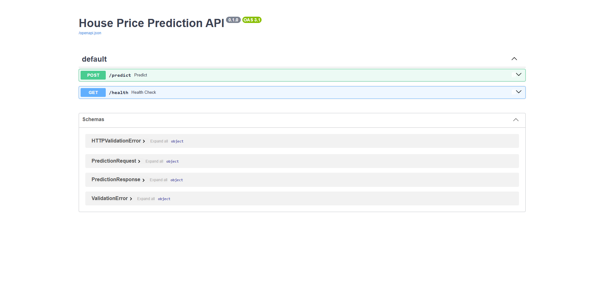
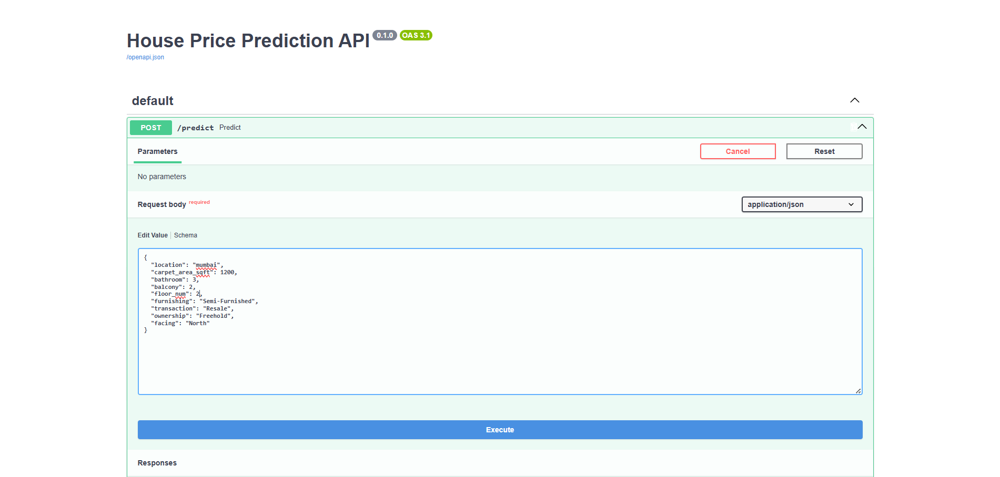
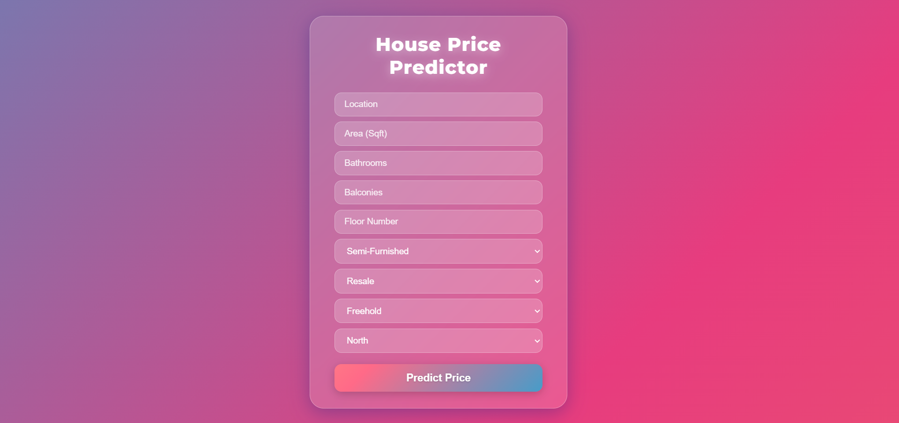
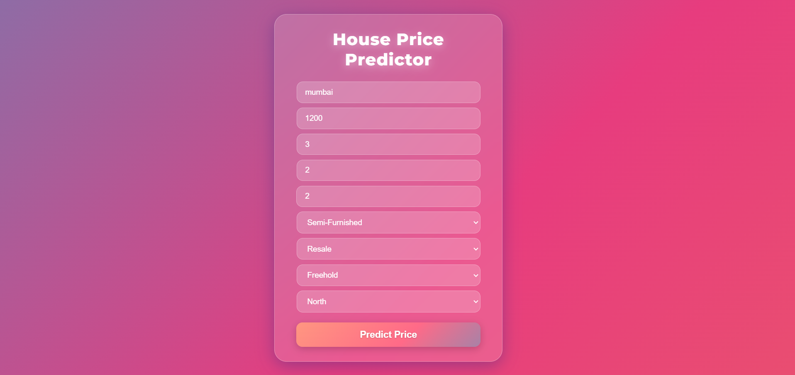
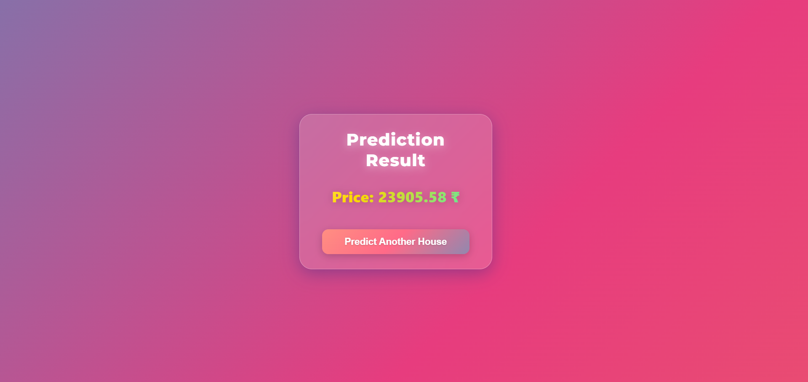

# House Price Prediction - End-to-End ML Web App

## 📝 Overview

A complete end-to-end machine learning product that predicts house prices based on raw data. The project covers the entire pipeline: from data cleaning and exploratory data analysis (EDA) to training a regression model, deploying it via a FastAPI backend, and serving predictions through a React frontend.

## 🛠️ Tech Stack

- **Machine Learning:** Python, Pandas, Scikit-Learn, Jupyter Notebook.
- **Backend:** FastAPI, Uvicorn, Pytest.
- **Frontend:** React, TypeScript, Vite.

## 🏗️ Architecture & Project Structure

```text
house-price-project/
├── .venv/                      # Python Virtual Environment
├── backend/                    # FastAPI Backend Application
│   ├── app/                    # API routes, core logic, models, and services
│   ├── tests/                  # Pytest test suite
│   ├── .env.example
│   ├── Dockerfile
│   └── requirements.txt
├── frontend/                   # React + Vite Frontend Application
│   ├── node_modules/           # Frontend dependencies
│   ├── public/
│   ├── src/                    # UI Components, pages, api client
│   ├── .env
│   ├── index.html
│   ├── package.json
│   └── vite.config.ts
├── notebooks/                  # ML Development Layer
│   ├── data/                   # Dataset directory
│   ├── house_price_model.ipynb # Jupyter Notebook for training
│   ├── metrics.txt             # Model evaluation metrics log
│   └── model_training.py       # Python training script
├── screenshots/                # Project UI & API Screenshots
│   ├── backend-swagger-1.png
│   ├── backend-swagger-2.png
│   ├── backend-swagger-3.png
│   ├── frontend-home.png
│   ├── frontend-input-form.png
│   └── frontend-result.png
├── .gitignore
├── my_old_env.txt              # Environment backup reference
├── package-lock.json
├── package.json
├── README.md                   # Project documentation
└── requirements.txt
```

## 📊 Dataset

- **Source:** [House Price Dataset by Juhi Bhojani on Kaggle](https://www.kaggle.com/datasets/juhibhojani/house-price)
- **Download:** Place `house_prices.csv` into the `notebooks/data/` folder, or use the Kaggle CLI:
  ```powershell
  kaggle datasets download -d juhibhojani/house-price -p notebooks/data --unzip
  ```

## 📈 Model Evaluation

| Model                      | MAE          | RMSE          | R² Score    |
| :------------------------- | :----------- | :------------ | :---------- |
| **Linear Regression**      | 2,703.32     | 44,374.10     | 0.0049      |
| **Random Forest (Chosen)** | **1,228.01** | **44,766.05** | **-0.0128** |

## 🔐 Environment Variables

Create the required environment variables before running the application.

| File Location   | Variable Name       | Description     | Default Value                |
| :-------------- | :------------------ | :-------------- | :--------------------------- |
| `backend/.env`  | `PROJECT_NAME`      | Name of the API | `House Price Prediction API` |
| `frontend/.env` | `VITE_API_BASE_URL` | Backend API URL | `http://localhost:8000`      |

## ⚙️ Setup & Installation (PowerShell)

### 1. Clone the Repository

```powershell
git clone [https://github.com/YoussefThabet74/house-price-project.git](https://github.com/YoussefThabet74/house-price-project.git)
cd house-price-project
```

### 2. Environment Setup & Testing

From the root of the project, activate the virtual environment and install dependencies:

```powershell
.venv\Scripts\Activate
pip install -r requirements.txt
```

Run the automated Pytest suite to ensure everything is working correctly (`3 passed` expected):

```powershell
pytest backend/tests/
```

### Frontend Production Build Check

Run the TypeScript/Vite build process to verify there are no compilation or type errors:

💡 **Hint:** Use the appropriate command based on your terminal's current location.

**🔹 If you are in the Root directory:**

```powershell
cd frontend
npm run build
```

**🔹 If you are already inside the `frontend` directory:**

```powershell
npm run build
```

### 3. Run the Backend Server

💡 **Hint:** Use the appropriate command based on your terminal's current location.

**🔹 If you are in the Root directory:**

```powershell
cd backend
uvicorn app.main:app --reload
```

**🔹 If you are already inside the `backend` directory:**

```powershell
uvicorn app.main:app --reload
```

- API Documentation is available at: `http://localhost:8000/docs`

### 4. Run the Frontend Application

Open a **new** PowerShell terminal.
💡 **Hint:** Use the appropriate command based on your terminal's current location.

**🔹 If you are in the Root directory:**

```powershell
cd frontend
npm install
npm run dev
```

**🔹 If you are already inside the `frontend` directory:**

```powershell
npm run dev
```

- Access the web application at: `http://localhost:5173`

## 🔌 API Reference

Example of making a prediction request using PowerShell:

**POST `/predict`**

```powershell
curl -X 'POST' `
  'http://localhost:8000/predict' `
  -H 'accept: application/json' `
  -H 'Content-Type: application/json' `
  -d '{
  "location": "mumbai",
  "carpet_area_sqft": 1200,
  "bathroom": 3,
  "balcony": 2,
  "floor_num": 2,
  "furnishing": "Semi-Furnished",
  "transaction": "Resale",
  "ownership": "Freehold",
  "facing": "North"
}'
```

## 📸 Screenshots

### 1. Backend - FastAPI Swagger UI (Overview)



### 2. Backend - API Request Execution / Test



### 3. Backend - API Response / Details


### 4. Frontend - Home Page



### 5. Frontend - Input Form



### 6. Frontend - Prediction Result


